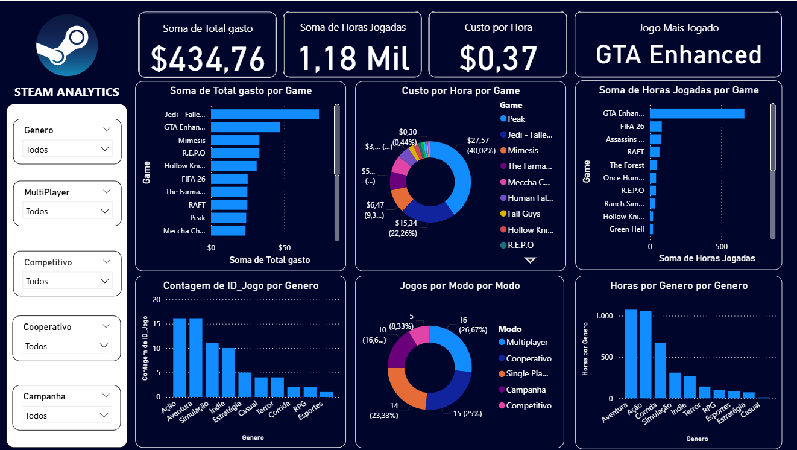

# 🎮 Steam Analytics

Projeto pessoal de análise de dados desenvolvido com o objetivo de explorar meus dados de jogos da Steam e transformar informações brutas em indicadores e visualizações através do Power BI.

O projeto foi desenvolvido como forma de praticar conceitos de **SQL, MySQL, Excel, Power Query, DAX e Power BI**, passando pelas etapas de organização, tratamento, análise e visualização dos dados.

---

## 📊 Dashboard

Dashboard desenvolvido no Power BI para análise dos dados dos jogos da Steam.

O dashboard apresenta indicadores e análises relacionados a:

- 💰 Gastos com jogos
- ⏱️ Horas jogadas
- 💵 Custo por hora
- 🎮 Jogos mais jogados
- 📈 Gastos por jogo
- 🎯 Horas jogadas por jogo
- 🕹️ Distribuição por gênero
- 👥 Modos de jogo
- 📊 Análises utilizando filtros e segmentações



---

## 🛠️ Tecnologias utilizadas

- **Power BI** — criação do dashboard e visualizações
- **Power Query** — tratamento e transformação dos dados
- **DAX** — criação de medidas e cálculos
- **MySQL / SQL** — consultas e manipulação dos dados
- **Excel** — organização e preparação dos dados
- **Git / GitHub** — versionamento e documentação do projeto

---

## 🔄 Processo do projeto

O desenvolvimento do projeto passou pelas seguintes etapas:

```text
Dados
  ↓
Organização
  ↓
SQL / MySQL
  ↓
Tratamento dos dados
  ↓
Power Query
  ↓
Modelagem
  ↓
DAX
  ↓
Power BI
  ↓
Dashboard
